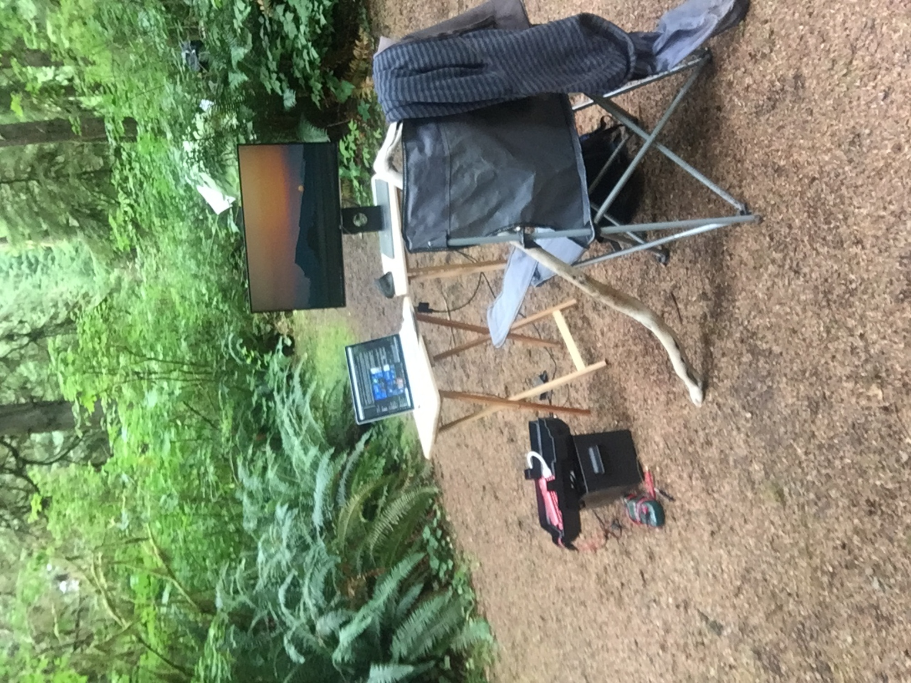
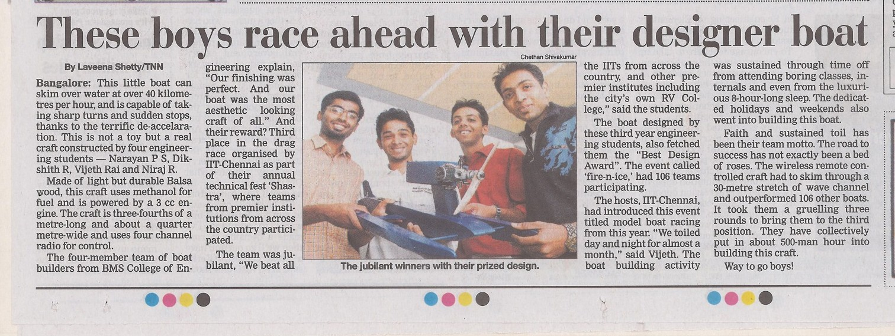

### Remote office in Olympic National Park

A pandemic is the best time to run into the woods. But what must one do when one has a thesis to write. 

One of my proudest achievements as an engineer was to be able to build a off-grid setup with marine deep cycle battery and full sine wave inverter. I rigged this up during the pandemic lockdown to be able to explore the  Olympic Nat'l Park and complete my thesis. My favorite office space ever!

### Undergrad Engineering Racing and Design Challenges at Indian Institute of Technology (IIT) TechFest

Objective: To build miniature racing beasts 

Our team of four built a 3hull - Airboat (1:15 scale model) designed primarily for speed, powered by  a 3.2cc engine. We won the Best Design and 3rd place in the race.

Also, built a miniature four wheel drive car (a 1:8 scale model) for IIT. The vehicle was powered by a 3cc engine and radio controlled. We placed 2nd National level. 

### 	Downhill  Prosthesis  								CU Boulder 	01/2011 – 12/2011 

 Advised by Prof Rodger Kram at University of Colorado at Boulder, I conducted independent research to develop prototype prosthesis using discarded skiis and dampers. Carbon fiber ski's for elasticity and dampers for heat dissipation during down-hill travel. 

I wish I could find a picture of this contraption.

###  “Mario-Cart” Competition (Mechatronics Course Project)  CU Boulder 

Objective: to build robotic Mario carts from ground up. Compete to spot and shoot rival team’s cart.

Designed PCBS for IR sensors, signal conditioning, power-supply and interfacing components with sbRio. Programmed sbRio in LabView.

We crashed and burned :(.

Skills: *EAGLE PCB Design, sbRio,  LabView*

### MultiRobot Surveillance Algortihm - Grad Class Project 

 
Goal was to implement most efficient area coverage and intruder detection. 

Implemented an algorithm to compute the amount of "stocastic" vs "planned" exploration polciy needed to optimally  surveill an area. E.Coli based gradient seeking was used for "planned" exploration. 

Skills: *Matlab OOPs*

