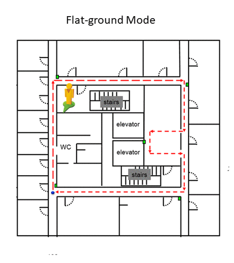

One of challenges of prosthesis control is knowing the right movement type for any given time. Human use vision for navigating everyday environments. 

We developed an applicaton built on Google's Project Tango hardware platform which used visual features to estimate location in a known environment (SLAM). Location estimates and motion is used for estimating right movement or prosthetic locomotion mode. 

{:.list-inline}
- Date: January 2017 - Mar 2019
- Skills: Machine Learning(LDA,SVM) , Android, ROS, Google Tango, MATLAB 

<!-- 

 [Rai et al. Evaluation of a Visual Localization System for Environment Awareness in Assistive Devices *(Engineering in Medicine and Biology Conference 2018)*](https://ieeexplore.ieee.org/abstract/document/8513442)

[Rai et al. Visual Localization for Prosthetic Lower Limb Control – American Academy of Orthotists and Prosthetists *(AAOP 2017)*](http://media.mycrowdwisdom.com.s3.amazonaws.com/aaop/Resources/JOP/2017/2017-F10.pdf "Visual Localization") 
  
 -->