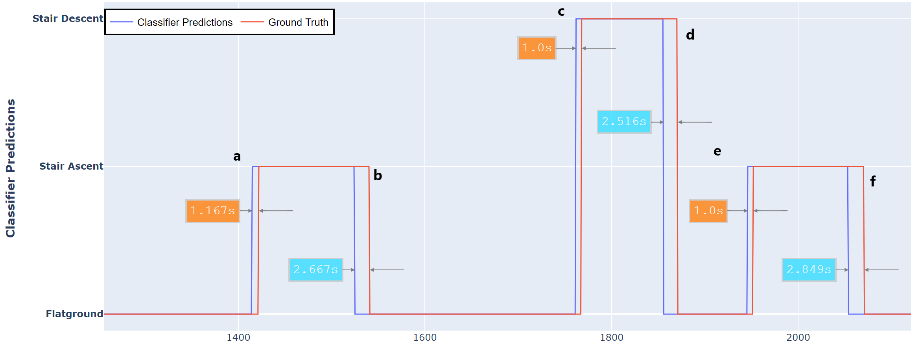

Imagine walking the world, with a blindfold. Thats how current prostheses navigate. 

As part of my doctoral thesis, using an ego-centric camera, I showed that vision can provide crucial information about the current environment to deduce the right prosthetic movements. More interstingly, the results showed that vision sensor is able 
detects changes in environment  prior to kinematics or EMG based sensors. This early detection can be used to cue smooth and safe control transitions in powered limbs. 

A limitation of results from vision based research is lack of generalizability. High accuracies are obtained in restricted lab settings or small enviroments. Knowledge 'learned' from other bigger datasets can be transferred and utilized to improve generalizability and accelerate deployment of vision sensors in prostheses. To offset my limited dataset, I used Transfer Learning technique to leverage the features learned from ImageNet dataset (1 million images) and showed improved accuracies as well. 

  

{:.list-inline}
- Date: January 2020 - Aug 2020
- Skills: Machine Learning (FastAI, PyTorch), Convolutional Neural Nets (CNN), Transfer Learning, Computer Vision, Wearable Motion Capture (Xsens)
